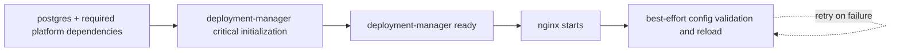

# Statement of Work: nginx and Deployment Manager Startup Decoupling

**Project:** Port-Au-Next — reliable reverse-proxy and control-plane startup  
**Date:** 2026-09-07  
**Status:** Implemented, including the Docker DNS routing extension
**Incident trigger:** Full Docker Compose rebuild caused `nginx` and `deployment-manager` to enter permanent restart loops

---

## 1. Executive Summary

A full Compose rebuild can leave `nginx` and `deployment-manager` unable to become stable. nginx reads `proxy_pass http://deployment-manager:3000` while loading its configuration and exits if Docker DNS cannot resolve the deployment-manager container at that moment. During its own startup, deployment-manager executes commands inside nginx to create log directories and inspect the nginx bind mount. If nginx is restarting, the required log-directory command throws; the top-level startup handler then exits deployment-manager. Both services use `restart: always`, so Docker repeatedly recreates the same failure sequence.

This refactor removes nginx from deployment-manager's critical startup path. nginx will initialize its own log filesystem, resolve the deployment-manager service through Docker DNS at request time, and wait for an explicit deployment-manager readiness signal before starting. Deployment-manager will continue managing nginx configuration, but nginx outages will produce a deferred reconciliation state rather than terminate the control-plane process.

The completed implementation was subsequently extended to remove ephemeral container IPs from application and platform-service vhosts. New application containers receive immutable deployment aliases, existing containers migrate through their unique Docker names, and nginx resolves both through Docker DNS at request time. Recovery now distinguishes production routes from stored preview subdomains and keeps only one active production route per application.

The target relationship is one-way at startup:



nginx may be unavailable while deployment-manager is running. During that interval, the dashboard and direct port `3000` remain available, desired configuration changes remain on disk, and reconciliation resumes when nginx returns.

---

## 2. Incident Analysis and Current Behavior

### 2.1 Observed failure sequence

1. Compose starts `deployment-manager`; `nginx` has `depends_on: deployment-manager`, which only waits for the container to enter the running state.
2. nginx parses `/etc/nginx/conf.d/default.conf` during process startup.
3. The static `proxy_pass http://deployment-manager:3000` causes nginx to resolve `deployment-manager` immediately.
4. If deployment-manager is between restarts or has not joined the Compose network, Docker DNS returns no address. nginx exits with:

   ```text
   nginx: [emerg] host not found in upstream "deployment-manager"
   ```

5. Deployment-manager's startup continues generating service vhosts. nginx reload failures are already caught and logged as warnings.
6. Deployment-manager then calls `ensureNginxAppsLogRoot()`, which runs `docker compose exec -T nginx ...`.
7. Because nginx is restarting, this call throws. The instrumentation startup catch block calls `process.exit(1)`.
8. `restart: always` restarts both containers and the sequence repeats.

### 2.2 Why `depends_on` does not prevent the incident

The short-form `depends_on` in `docker-compose.yml` provides creation order only. Compose considers deployment-manager started as soon as its container process runs. It does not wait for the Next.js application, database migrations, or startup instrumentation to finish. It also does not keep deployment-manager running, restart nginx after an upstream recovery, or protect either service from transient Docker DNS gaps.

### 2.3 Current coupling points

| Coupling | Current behavior | Failure effect |
|---|---|---|
| `nginx/conf.d/default.conf` | Resolves `deployment-manager` while nginx parses config | Missing DNS record prevents nginx from starting |
| `deployment-manager/src/instrumentation.ts` | Awaits nginx mount inspection during startup | Adds delay and startup ordering ambiguity |
| `deployment-manager/src/lib/nginxLogs.ts` | Uses `docker compose exec nginx` to create every nginx log directory | nginx outage can fail startup or an app deployment |
| Service-vhost startup functions | Write config and immediately attempt nginx reload | Repeated warnings; successful file creation is reported as a successful apply |
| Top-level startup error handler | Treats all initialization failures as fatal | Optional reverse-proxy work can terminate the control plane |
| `restart: always` on both services | Restarts any exited process indefinitely | Converts the circular dependency into a permanent loop |

### 2.4 Unrelated warning

The observed warning for `feature/local-database.delay.mx` is caused by a slash from a branch name appearing in `server_name`. It is not the trigger for this incident because nginx treats it as a warning. Hostname normalization and validation should be handled separately unless implementation discovers that an invalid generated hostname can produce a fatal nginx configuration error.

---

## 3. Goals

1. Deployment-manager reaches and maintains readiness without nginx being present.
2. nginx can start while deployment-manager is temporarily absent and returns `502` until the upstream becomes resolvable.
3. Compose starts nginx only after deployment-manager has completed its critical initialization.
4. nginx owns initialization of `/var/log/nginx/apps`; deployment-manager does not need to execute a command inside nginx to create directories.
5. Per-deployment nginx log directories are created through the shared bind mount without requiring nginx container availability.
6. nginx configuration writes, validation, reloads, and retries report accurate states and never terminate deployment-manager solely because nginx is unavailable.
7. A malformed generated configuration cannot permanently poison nginx startup without a clear validation error and recovery path.
8. Rebuilding or restarting both services together converges automatically without manual command timing.

---

## 4. Non-Goals

| Item | Reason |
|---|---|
| Replacing nginx with another reverse proxy | The incident is caused by lifecycle coupling, not nginx's core proxy behavior |
| Removing deployment-manager's ability to generate application and platform vhosts | Dynamic route management remains a required platform capability |
| Replacing the existing image-build and blue/green deployment model | The routing extension preserves the existing model while making health-gated cutover safe |
| Changing public domains, TLS termination, or Cloudflare tunnel ownership | No public routing contract needs to change |
| Using container IPs as the permanent fix | Container IPs change when containers are recreated and therefore preserve a different availability problem |
| Treating restart limits as the primary solution | Limiting restarts stops the loop but does not make either service recover correctly |

---

## 5. Target Design

### 5.1 Separate critical initialization from optional reconciliation

Refactor deployment-manager startup into two explicit classes:

| Class | Examples | Failure policy |
|---|---|---|
| Critical initialization | Database connectivity and migrations; configuration required to serve authenticated deployment-manager requests | Log the exact failure, remain unready, and exit so Docker can retry |
| Optional reconciliation | nginx mount inspection, service-vhost generation/application, nginx reload, container recovery, and Cloudflare platform-route synchronization | Log a warning, expose the failure state, retry with bounded backoff, and keep the process running |

The readiness endpoint must return success only after critical initialization completes. Optional reconciliation begins after readiness and must not call `process.exit(1)`.

The existing global `try/catch` in `instrumentation.ts` should be replaced with an orchestrator that records each step's result. A failure in one optional integration must not suppress unrelated optional work.

### 5.2 Add explicit deployment-manager health endpoints

Add unauthenticated internal endpoints with no external service dependencies:

| Endpoint | Meaning | Response |
|---|---|---|
| `GET /api/health/live` | The Next.js process can serve requests | `200` while the process is responsive |
| `GET /api/health/ready` | Critical startup initialization has completed | `200` when ready; `503` before completion or after a critical readiness failure |

Readiness state should live in one process-wide module and include a short machine-readable reason when unready. The implementation must confirm that the standalone Next.js build shares this state between instrumentation and the route handler. If module bundling creates separate instances, use a process-global symbol or another in-process mechanism that is reset at process launch.

Add a Compose health check to deployment-manager using the installed `curl` binary and the readiness endpoint. Use a start period long enough for ordinary migrations, a short interval during initial startup, and retries that cover slow but healthy hosts. Exact timing should be selected from observed cold-start duration; an initial target is:

```yaml
healthcheck:
  test: ["CMD-SHELL", "curl -fsS http://localhost:3000/api/health/ready >/dev/null || exit 1"]
  interval: 5s
  timeout: 3s
  retries: 12
  start_period: 20s
```

Change nginx to long-form `depends_on` with `condition: service_healthy`. This ensures clean cold-start ordering. Runtime recovery must still work independently because `depends_on` does not manage dependencies after startup.

### 5.3 Resolve the deployment-manager upstream at request time

Change both the default nginx route and the deployment-manager public service vhost to use Docker's embedded DNS resolver (`127.0.0.11`) with a variable-based `proxy_pass`. This prevents nginx from treating a temporarily missing upstream as a fatal configuration error.

Conceptual form:

```nginx
resolver 127.0.0.11 valid=10s ipv6=off;
set $deployment_manager_upstream deployment-manager:3000;
proxy_pass http://$deployment_manager_upstream;
```

Required behavior:

- nginx starts even when `deployment-manager` has no current DNS record.
- Requests receive `502 Bad Gateway` while the upstream is unavailable.
- Requests recover after Docker DNS returns the service address, without requiring nginx to restart.
- Existing headers, body-size limits, timeouts, and URI forwarding behavior remain unchanged.

The implementation must test URI handling because nginx changes some `proxy_pass` behavior when variables are introduced. Requests with paths, query strings, redirects, large request bodies, and authentication cookies must reach deployment-manager unchanged.

For this SOW, runtime DNS conversion is required for deployment-manager routes. Converting every platform service and deployed application upstream should only be included if the same helper can preserve current routing semantics and the additional integration cases are tested.

### 5.4 Move nginx log-root ownership into nginx initialization

Add an executable script under `nginx/docker-entrypoint.d/` and mount it into the official nginx entrypoint directory. The script runs as root before nginx starts and performs idempotent initialization:

```text
mkdir -p /var/log/nginx/apps
chown 1000:nginx /var/log/nginx/apps
chmod 2775 /var/log/nginx/apps
```

The script must use numeric ownership deliberately where host bind-mount behavior requires it and document the UID/GID assumptions for the `node` and `nginx` image users. It must be safe on every nginx restart and fail nginx startup with a clear error only when the mounted log directory genuinely cannot be prepared.

Remove `ensureNginxAppsLogRoot()` from deployment-manager startup. No control-plane process should need a running proxy merely to establish proxy-owned filesystem permissions.

### 5.5 Create deployment log directories through the shared bind mount

Refactor `ensureNginxDeploymentLogDir()` to operate on the host-visible path already mounted at `/app/nginx/logs` in deployment-manager. It should:

1. Validate `appName` and `deploymentId` using the current restrictions.
2. Resolve the directory beneath the canonical nginx apps-log root and reject traversal.
3. Create the directory recursively.
4. Apply group-writable/setgid permissions compatible with the root initialized by nginx.
5. Return the existing nginx-container log paths used in generated vhosts.

This removes nginx availability from application config generation. A deployment may prepare its desired vhost and log path while nginx is recovering; applying the vhost becomes a separate reconciliation action.

### 5.6 Separate desired configuration from live application

Treat files under `nginx/conf.d` as desired state and nginx's loaded configuration as applied state.

Refactor the current `write -> reload -> report success` flow into these operations:

1. **Render and validate input** — reject invalid domains, paths, upstreams, and unsafe filenames before writing.
2. **Write desired config atomically** — write a temporary sibling file, fsync/close as appropriate, then rename into place.
3. **Validate aggregate nginx config** — when nginx is available, run `nginx -t` against the complete mounted configuration.
4. **Apply** — reload only after validation succeeds.
5. **Defer** — if nginx is absent or restarting, retain valid desired state and enqueue one reconciliation attempt.
6. **Roll back invalid output** — if `nginx -t` proves the new file invalid, restore the last known-good version or remove a newly created file, then re-run validation to confirm recovery.

Return an explicit result instead of logging unconditional success:

```ts
type NginxApplyResult =
  | { status: 'applied' }
  | { status: 'deferred'; reason: string }
  | { status: 'rejected'; reason: string };
```

Callers may treat `deferred` as a successful desired-state update with a visible warning. `rejected` should fail the specific route or deployment operation because the requested configuration is invalid, while leaving the previous live configuration intact.

### 5.7 Add a bounded nginx reconciliation worker

Use a single in-process reconciliation queue or mutex so simultaneous startup tasks and deployments do not run overlapping `nginx -t` and reload commands.

The worker should:

- coalesce multiple config writes into one validation/reload pass;
- check whether nginx is running before attempting `docker exec`;
- retry transient unavailable/restarting errors with bounded exponential backoff and jitter;
- reset the retry sequence when new work arrives or nginx becomes available;
- keep only one pending retry timer;
- log the transition into `deferred`, the eventual successful apply, and terminal validation rejection;
- stop scheduling work when the Node process shuts down.

The existing nginx mount-health check may run through this worker after deployment-manager readiness. It must remain nonfatal and preserve `--no-deps` when recreating nginx so it cannot recreate or terminate deployment-manager from inside deployment-manager's own process.

### 5.8 Preserve restart policies with observable health

Keep `restart: always` unless operations policy calls for a separate change. Once the circular fatal dependency is removed, automatic restart is useful for real crashes. Health state and structured reconciliation logs will distinguish a recovering dependency from a crashing process.

An nginx health check may be added using `nginx -t` or a local lightweight route. It is useful for status and deployment-manager reconciliation decisions, but deployment-manager must never require nginx to be healthy to remain alive.

---

## 6. Implementation Scope by File

| File or area | Planned change |
|---|---|
| `docker-compose.yml` | Add deployment-manager health check; change nginx dependency to `service_healthy`; mount nginx initialization script; optionally add nginx health check |
| `nginx/conf.d/default.conf` | Use Docker DNS and request-time resolution for the deployment-manager upstream |
| `nginx/conf.d/service-deployment-manager.conf` | Remove the tracked container IP and use the same service-name resolution strategy |
| `nginx/docker-entrypoint.d/40-init-app-logs.sh` | New idempotent log-root initialization script |
| `deployment-manager/src/app/api/health/live/route.ts` | New unauthenticated liveness route |
| `deployment-manager/src/app/api/health/ready/route.ts` | New readiness route backed by critical startup state |
| `deployment-manager/src/lib/readiness.ts` | Process-wide readiness state and reason tracking |
| `deployment-manager/src/instrumentation.ts` | Split critical initialization from optional background reconciliation; remove fatal nginx log-root call |
| `deployment-manager/src/lib/nginxLogs.ts` | Replace `docker compose exec nginx` directory creation with safe shared-bind-mount filesystem operations |
| `deployment-manager/src/services/nginx.ts` | Separate render/write/apply; atomic writes; typed apply results; serialized reload; transient retry; post-readiness mount check |
| `deployment-manager/src/lib/startup.ts` | Generate the deployment-manager vhost from the stable Compose service name instead of discovering its current container IP |
| `deployment-manager/src/utils/compose.ts` | Add only the service/health inspection primitives required by the reconciler; preserve explicit project/file handling |
| Operational documentation | Document readiness, deferred nginx application, recovery behavior, and log ownership assumptions |

Implementation may consolidate the two health endpoints into one route if the response clearly distinguishes liveness from readiness and Compose consumes the readiness state.

---

## 7. Implementation Phases

### Phase 1 — Health contract and startup classification

- [x] Inventory every function awaited by `instrumentation.ts` and classify it as critical or optional.
- [x] Add process-wide startup/readiness state.
- [x] Add liveness and readiness API routes.
- [x] Make critical failures keep readiness false and exit with one clear root-cause log.
- [x] Run optional work after readiness, isolate failures per task, and remove optional calls from the fatal catch path.
- [x] Add the deployment-manager Compose health check.
- [x] Change nginx `depends_on` to `condition: service_healthy`.

**Deliverable:** Compose has a truthful deployment-manager readiness signal, and reverse-proxy work cannot terminate deployment-manager.

### Phase 2 — nginx self-initialization and log-path decoupling

- [x] Add and mount the nginx entrypoint log initialization script.
- [x] Verify UID/GID behavior on the actual bind-mounted host filesystem.
- [x] Remove `ensureNginxAppsLogRoot()` and its startup invocation.
- [x] Refactor per-deployment log-directory creation to use `/app/nginx/logs` directly.
- [x] Verify both nginx workers and deployment-manager can create/read/remove the expected log files.
- [x] Confirm retention cleanup no longer reports permission-denied errors for directories created after the refactor.

**Deliverable:** No deployment-manager startup or deployment operation executes nginx merely to manage directories.

### Phase 3 — Resilient upstream resolution

- [x] Convert `default.conf` to request-time Docker DNS resolution.
- [x] Convert the deployment-manager public service vhost to the same strategy.
- [x] Stop resolving deployment-manager's own container IP during vhost setup.
- [x] Route platform services through stable Compose DNS names.
- [x] Route application deployments through immutable deployment aliases or legacy container names.
- [x] Resolve application upstreams at request time instead of retaining container IPs.
- [x] Require green-container HTTP readiness before traffic switches.
- [x] Recover preview routes through their stored sanitized subdomains.
- [x] Keep one active production route per application regardless of historical branch changes.
- [x] Validate management API path forwarding through the runtime-resolved upstream.
- [x] Confirm nginx starts with deployment-manager stopped and recovers routing after deployment-manager starts.

**Deliverable:** A missing or recreated deployment-manager upstream cannot prevent nginx from running.

### Phase 4 — Desired-state reconciliation

- [x] Introduce typed `applied`, `deferred`, and `rejected` results.
- [x] Make configuration file replacement atomic.
- [x] Serialize nginx validation and reload operations.
- [x] Add bounded retries for transient nginx unavailability.
- [x] Roll back only configurations rejected by `nginx -t`; preserve desired state when application is merely deferred.
- [x] Coalesce concurrent reload requests and retry timers.
- [x] Move the mount-health check behind readiness.
- [x] Update config-application logs to distinguish desired-state writes from live application.

**Deliverable:** Configuration changes converge after nginx recovery and invalid output cannot replace the last known-good configuration silently.

### Phase 5 — Integration validation and operational handoff

- [x] Run simultaneous-rebuild and independent-restart scenarios from the test matrix.
- [x] Observe restart counts and health transitions for a complete recovery cycle.
- [x] Validate the aggregate existing app, preview, and platform vhost configuration with `nginx -t`.
- [x] Document expected `502`, `unhealthy`, `deferred`, and recovered states.
- [x] Record a short operator recovery procedure for truly invalid tracked configuration.

**Deliverable:** The refactor is demonstrated under the failure conditions that triggered this SOW and is supportable after release.

---

## 8. Acceptance Criteria

1. `docker compose up -d --build` from a stopped stack converges with both `deployment-manager` and `nginx` running without manual sequencing.
2. Rebuilding both services simultaneously does not increment either restart count because of the other service's temporary state.
3. Deployment-manager becomes healthy only after critical initialization completes.
4. Stopping nginx does not stop, restart, or mark deployment-manager unready.
5. Starting deployment-manager while nginx is stopped succeeds; nginx-related startup work is logged as deferred.
6. Starting nginx while deployment-manager is stopped succeeds; requests to deployment-manager routes return `502` rather than terminating nginx.
7. Starting deployment-manager afterward restores proxied requests without recreating nginx.
8. Recreating deployment-manager with a new container IP restores proxied requests after the configured DNS cache interval without a manual nginx reload.
9. nginx creates `/var/log/nginx/apps` with permissions that allow both nginx log writes and deployment-manager retention cleanup.
10. Creating an application deployment log directory does not call `docker exec` or `docker compose exec nginx`.
11. A config update made while nginx is unavailable is applied automatically after nginx returns.
12. Multiple config updates during an nginx outage are coalesced and do not spawn unbounded retry loops.
13. A syntactically invalid generated config is rejected, the previous valid config remains usable, and the relevant operation receives an actionable error.
14. Existing application, preview, MinIO, imgproxy, port-schedule, Umami, Bugsink, and deployment-manager routes retain their current headers, ports, and body-size behavior.
15. The implementation introduces no new dependency on fixed Docker container IP addresses.

---

## 9. Test Plan

### 9.1 Static and build validation

| Check | Expected result |
|---|---|
| `docker compose config` | Valid model; nginx waits on deployment-manager health |
| Deployment-manager production build | TypeScript/Next.js build completes |
| Shell syntax check for nginx entrypoint script | Script parses successfully in Alpine `sh` |
| `nginx -t` against the complete mounted configuration | All tracked and generated configs pass |

### 9.2 Lifecycle integration matrix

| Scenario | Procedure | Expected result |
|---|---|---|
| Clean cold start | Stop stack, then build/start all services | Both services converge without restart loop |
| Simultaneous rebuild | Force-recreate deployment-manager and nginx together | nginx waits for readiness, then starts once |
| nginx absent during manager start | Stop nginx; restart deployment-manager | Manager stays healthy; reconciliation is deferred |
| Manager absent during nginx start | Stop manager; start nginx with dependencies disabled for the test | nginx stays running; route returns `502` |
| Manager recovery | Start manager after previous scenario | Route recovers after DNS TTL without nginx restart |
| Manager recreation | Force-recreate manager and confirm IP changes | nginx routes to new address after DNS refresh |
| nginx crash during config update | Stop nginx immediately before writing a vhost | Desired file persists; one retry path applies it later |
| Invalid generated config | Inject a controlled invalid candidate through the config service test seam | Apply is rejected; previous live config remains valid |
| Burst updates | Trigger several vhost writes concurrently | One serialized validation/reload sequence; no race or corruption |
| Host reboot | Restart Docker/host test environment | Stack converges without an operator running commands in a narrow window |

### 9.3 Functional regression checks

- Deployment-manager login and dashboard navigation through nginx.
- Deployment creation, traffic switch, rollback, and container recovery.
- Production and preview application routing, including query strings and static assets.
- Platform service routing for MinIO, imgproxy, port-schedule, Umami, and Bugsink.
- nginx access/error log creation and dashboard log viewing.
- Log retention cleanup for expired deployment directories.
- Cloudflare tunnel route sync after startup.

No broad test framework needs to be introduced solely for this work. Pure rendering, path-containment, readiness-state, and retry-state functions should receive focused automated tests if the repository gains or already has a suitable runner during implementation. The Docker lifecycle matrix remains required because the original defect depends on real Compose, DNS, bind-mount, and restart behavior.

---

## 10. Rollout Plan

1. Capture the current generated `nginx/conf.d` tree and confirm it passes `nginx -t` before deployment.
2. Deploy Phase 1 and Phase 2 together so the new startup order does not retain the fatal log-root command.
3. Deploy request-time DNS configuration and verify direct port `3000` access remains available during nginx replacement.
4. Rebuild deployment-manager first; wait for its health check to pass.
5. Recreate nginx and verify its entrypoint initializes log permissions and its health remains stable.
6. Exercise an intentional nginx stop/start and deployment-manager recreation before declaring rollout complete.
7. Monitor container restart counts, readiness status, nginx validation results, and deferred reconciliation duration.

The rollout should not rely on a one-time manual start order as the permanent remedy. A successful release must also pass a later simultaneous force-recreate.

### Rollback

Keep the previous known-good Compose file, nginx configs, and deployment-manager image tag available. If runtime DNS proxy behavior changes request routing, roll back the nginx config and image together. If the readiness endpoint or startup split fails, direct port `3000` provides the diagnostic path while nginx remains isolated.

Rollback must restore the previous log-directory ownership deliberately if the old deployment-manager image still expects to run `chown` inside nginx.

---

## 11. Observability and Operator Experience

Use structured log events for these state changes:

| Event | Required fields |
|---|---|
| Deployment-manager readiness changed | `ready`, `reason`, `durationMs` |
| nginx config apply deferred | `reason`, `pendingGeneration`, `retryAttempt`, `nextRetryMs` |
| nginx config applied | `generation`, `filesChanged`, `durationMs` |
| nginx config rejected | `file`, sanitized `nginx -t` error, `rollbackSucceeded` |
| nginx mount repair attempted | container ID, result, duration |
| Reconciliation recovered | attempts, total deferred duration |

Avoid logging the same unavailable-container warning once per generated service vhost. Coalescing should yield one deferred event and one recovery event for a startup batch.

The health endpoints must not disclose secrets, environment variables, container IDs, filesystem paths, or stack traces. A readiness failure reason should be a stable category such as `initializing`, `database_unavailable`, or `migration_failed`.

---

## 12. Risks and Mitigations

| Risk | Mitigation |
|---|---|
| Variable-based `proxy_pass` changes URI construction | Add explicit path/query regression tests before rollout |
| Docker DNS caching delays upstream recovery | Use a short bounded `valid` interval and verify recovery timing |
| Readiness state is duplicated by Next.js bundling | Test the standalone image; use `globalThis` state if necessary |
| Entry-point UID/GID assumptions differ across image versions | Pin/test the nginx image and document numeric ownership expectations |
| Atomic file writes still expose an invalid aggregate config | Validate all inputs; test aggregate config; restore last known-good file on rejection |
| Retrying reloads creates process/timer leaks | One serialized worker, one timer, bounded backoff, shutdown cleanup |
| Optional startup tasks silently stop working | Persist/log per-task results and emit recovery events; do not use empty catches |
| nginx starts with stale generated IP-based configs for other services | Validate existing files at rollout and consider service-name conversion as separately tested follow-up work |
| A host-filesystem permission model prevents node-owned directory creation | Verify bind-mount behavior before removing the exec path; adjust entrypoint ownership once, not at runtime from deployment-manager |

---

## 13. Definition of Done

- All acceptance criteria pass on a real Docker Compose environment.
- The simultaneous rebuild that originally reproduced the incident completes without either container restarting.
- Deployment-manager has no startup-fatal call into nginx.
- nginx log-directory creation has no deployment-manager-to-nginx exec dependency.
- nginx can load its configuration with deployment-manager absent.
- Deferred configuration changes converge automatically after nginx recovery.
- Operators can distinguish initialization, dependency outage, invalid configuration, and recovery from health state and logs.
- Documentation describes normal startup, degraded behavior, validation failure, and rollback.

---

## 14. References

| Resource | Location |
|---|---|
| Compose service definitions | `docker-compose.yml` |
| Default deployment-manager proxy | `nginx/conf.d/default.conf` |
| Public deployment-manager vhost | `nginx/conf.d/service-deployment-manager.conf` |
| Next.js startup instrumentation | `deployment-manager/src/instrumentation.ts` |
| nginx config generation/reload | `deployment-manager/src/services/nginx.ts` |
| nginx log-directory management | `deployment-manager/src/lib/nginxLogs.ts` |
| Platform vhost startup functions | `deployment-manager/src/lib/startup.ts` |
| Compose execution helpers | `deployment-manager/src/utils/compose.ts` |
